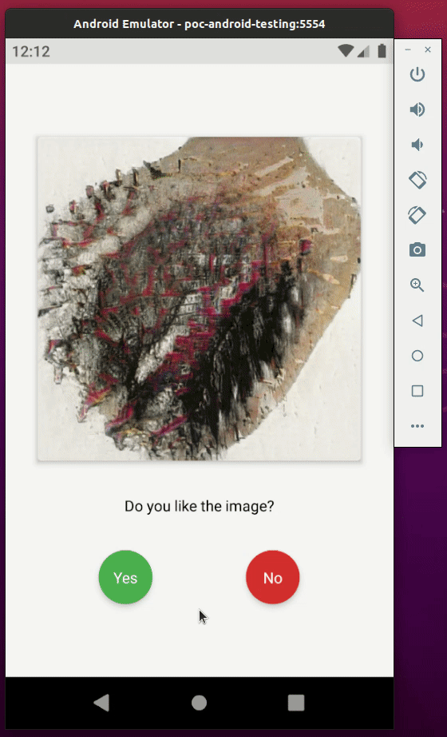
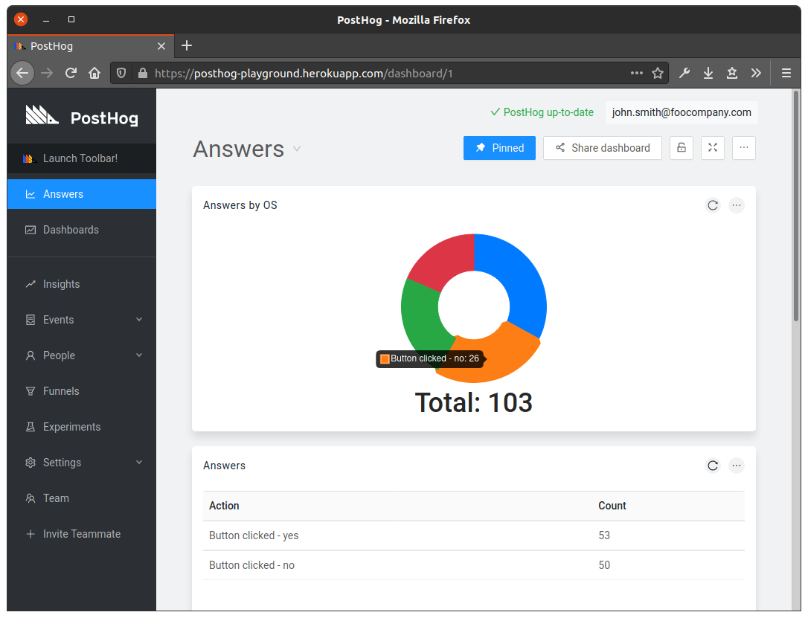
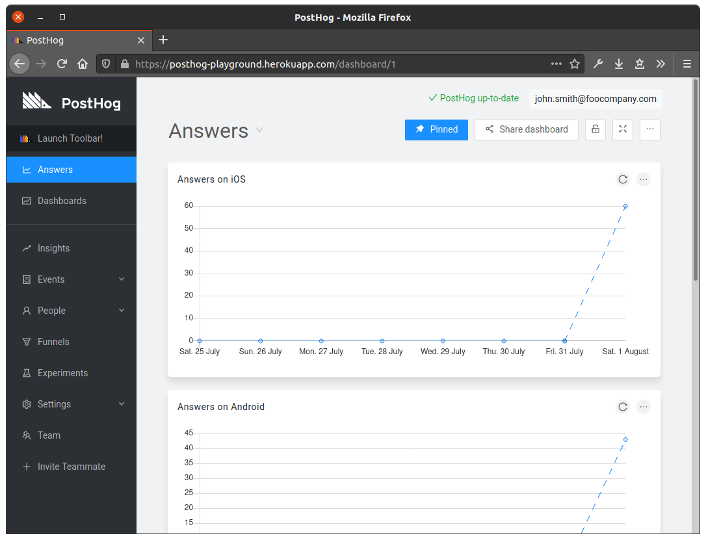
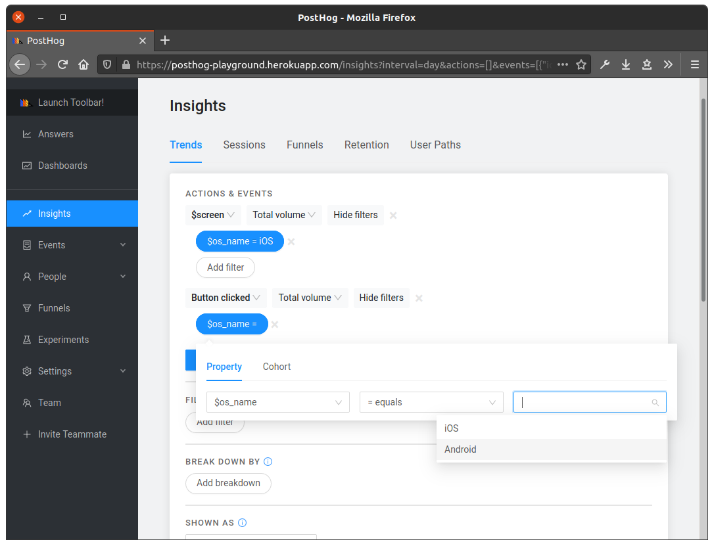

# POC: PostHog

It demonstrates how to collect metrics from devices and user behavior using [PostHog](https://github.com/posthog).

The mobile application obtains an image from [This Artwork Does Not Exist](https://thisartworkdoesnotexist.com/) API and displays it to the user and allow them to rate the image using yes or no buttons according to their preference. Each time the user rates an image a new one is loaded.

We want to know things like OS name, OS version and timezone from the device of each user to decide, for example, what Android version we should support or not.

We also want to understand their behavior based on the answers (yes or no).

## How to run

| Description | Command |
| :--- | :--- |
| Install dependencies | `npm install` |
| Run unit tests | `npm test` |
| Run the app on Android | `npm run android` |
| Run the app on iOS | `npm run ios` |
| Create the emulator | `make create`  |
| Delete the emulator | `make delete`  |
| Start the emulator | `make device`  |
| Provision infrastructure | `make up` |
| Destroy infrastructure | `make down` |
| Get dashboard IP | `make ip` |

> Note: PostHogs URL and access token must be set manually in `index.js`.

## Preview

